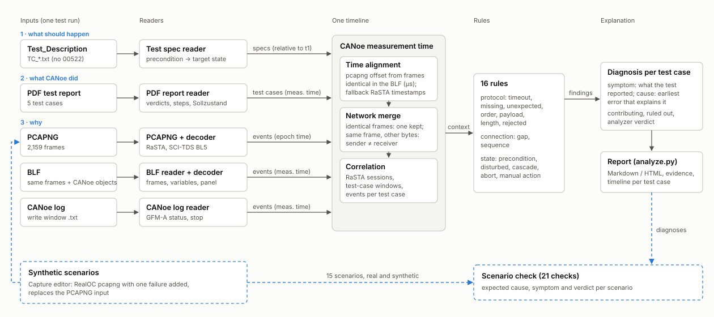

# Multi-Source Trace Failure Analysis

Finds the most probable root cause of a failed CANoe SCI-TDS test case by correlating everything one test run
leaves behind: the Test_Description (what should happen), the CANoe PDF report (what CANoe did), and the PCAPNG
capture, BLF log and CANoe write-window log (why). All observations go on one timeline in CANoe measurement
time. 16 rules check that timeline, and each test case gets a diagnosis that separates the symptom (what the
test reported) from the cause (the earliest error that explains it), with evidence down to the frame, page or
line.



This is Task #7 (Data Analysis) of the project assignment. For the background, decisions and open questions on
one page, see [IMPORTANT_TO_KNOW.md](IMPORTANT_TO_KNOW.md).

## What it reports

For the RealOC run of 2026-10-02 (`python analyze.py --test-case 02288`):

```
Test Result:       FAILED (TC_NPRO.295.02288.01)
Detected failure:  300.288 s  Precondition not reached: target Belegung/Grundstellbarkeit 2/0 (Test_Description), actual 3/0
Root cause:        186.953 s  34W1 became disturbed (Belegungszustand 3) 102 ms after an occupied report with
                              Achszählfüllstand 0x0000; reset possible for 50 s but no AZG/AZGH sent
Category:          Field element / test bench state (device_disturbed)
Consequence:       Cleanup failed, so TC_NPRO.295.00525.01(F-ReZE) started in the state this test case left (cascade failure).
Confidence:        high (0.95); evidence from BLF, CANoe log, pcapng
```

Each section also lists:

- the evidence, e.g. `pcapng frame 425 at 186.953 s (12:27:06.906)`,
- further findings, here an `incorrect_length` error: step 2 expects a 48-byte status and the RealOC sends 47
  bytes,
- the categories that were checked and ruled out,
- a timeline chart and every event of the test window.

Full example: [docs/example_report/TC_NPRO.295.02288.01.md](docs/example_report/TC_NPRO.295.02288.01.md),
also as HTML.

| Test case | CANoe | Analyzer | Root cause |
|---|---|---|---|
| 02283 (O) | pass | pass | - |
| 02284 (F) | pass | pass | - |
| 02288 (O) | fail | fail | GFM-A disturbed during manual occupation, never reset |
| 00525 (F-ReZE) | fail | fail | cascade: started in the disturbed state left by 02288 |
| 00522 (O-ReZE) | inconclusive | inconclusive | test unit stopped by the user |

## Quick start (macOS)

```bash
python3.11 -m venv .venv
.venv/bin/pip install -e ".[dev]"
.venv/bin/python analyze.py                    # → output/report.md, output/report.html
open output/report.html
```

The analyzer needs only Python 3.11 or newer. The input files are expected where `config/config.yaml` points,
`TDS_Task/TDS_Task/` by default. They are not in the repository; see [Confidentiality](#confidentiality).

You also need Wireshark to view the traces and to run the full test suite, which cross-checks the decoder
against the NeuPro Lua dissectors:

1. Wireshark 4.6+: `brew install --cask wireshark-app` (provides `tshark`).
2. NeuPro Lua dissectors: copy the `1_RaSTA` and `2_SCI` folders from `TDS_Task/Wireshark/LUA.zip` into the
   personal Lua plugin folder (Wireshark: Help → About Wireshark → Folders → Personal Lua Plugins), e.g.
   `~/.local/lib/wireshark/plugins/neupro/`. Wireshark 4.x loads them automatically.
3. SCI-TDS baseline **BL 5**: Edit → Preferences → Protocols → SCI → TDS Protokoll, or `sci.tds_bl: BL 5` in
   `~/.config/wireshark/preferences`.

## Usage

```bash
.venv/bin/python analyze.py [--config config/config.yaml] [--out DIR] [--format md html]
                            [--test-case ID ...] [--name report]
```

| Option | Meaning |
|---|---|
| `--config` | configuration file (default `config/config.yaml`) |
| `--out` | output directory (default `output/`) |
| `--format` | `md`, `html` or both (default both) |
| `--test-case` | only test cases whose name contains ID; repeatable (`--test-case 02288`) |
| `--name` | report file name without extension (default `report`) |

The command prints a verdict table and writes two reports:

- `report.md`, with one timeline SVG per test case next to it,
- `report.html`, self-contained (no external resources), in light and dark.

After `pip install -e .`, `trace-analyzer` runs the same command. Exit code 2 means a bad configuration or no
matching test case.

From Python:

```python
from trace_analyzer.config import load_config
from trace_analyzer.pipeline import analyze
from trace_analyzer.report import write_reports

result = analyze(load_config())          # timeline, context, findings, one diagnosis per test case
for d in result.diagnoses:
    print(d.test_case.name, d.verdict.value, d.cause and d.cause.summary)
write_reports(result, "output")
```

## Configuration

The configuration is `config/config.yaml`. Paths are relative to `base_dir`, which is relative to the config
file.

| Key | Meaning |
|---|---|
| `data.*` | pcapng, BLF, PDF report, CANoe log and Test_Description folder; a missing file is skipped |
| `sources.blf_ethernet` | `false` uses the BLF only for its CANoe objects, not its Ethernet frames |
| `protocol.sci_tds_baseline` | SCI-TDS baseline of the decoder; only BL5 is implemented |
| `protocol.rasta_udp_port` | RaSTA UDP port (24001) |
| `nodes.test_system`, `nodes.dut` | IP and SCI ID of CANoe (ESTW-ZE) and of the device under test; they define TX and RX |
| `timing.response_timeout_ms` | response limit when the Test_Description gives none (500 ms) |
| `rasta.max_message_gap_ms` | longest allowed silence on a RaSTA connection (750 ms, an assumption) |
| `alignment.max_spread_ms` | tolerance between sources; a larger difference gives a `time_alignment` finding |
| `output.dir` | default output directory |

## Analysis scenarios

The task defines 15 scenarios:

1. timeout
2. missing message
3. unexpected response
4. wrong order
5. invalid payload
6. incorrect length
7. connection interruption
8. sequence gap
9. precondition not reached
10. disturbed GFM-A
11. cascade
12. abort
13. configuration mismatch
14. command rejected
15. clock offset

Scenarios the real run contains are checked on it. For the others, the tool builds a synthetic capture: a copy
of the RealOC pcapng with one failure edited in at RaSTA level.

```bash
.venv/bin/python -m trace_analyzer.synthetic    # writes data/synthetic/S*.pcapng, checks all 21 expectations
```

Details, edits and results: [docs/scenarios.md](docs/scenarios.md).

## Tests

```bash
.venv/bin/pytest          # 168 tests
```

The tests cover:

- the readers, with the decoder checked against tshark and the NeuPro dissectors,
- time alignment against the Phase 1 ground truth ([tests/fixtures/ground_truth.yaml](tests/fixtures/ground_truth.yaml)),
- every rule on small synthetic contexts,
- the diagnosis of all five real test cases,
- the capture editor and all scenarios,
- the report and the CLI.

Tests that need the confidential input data are skipped when it is missing.

## Demo

- [docs/demo.md](docs/demo.md): a 10-minute walkthrough.
- `scripts/demo.sh`: runs the walkthrough end to end.
- [docs/presentation.html](docs/presentation.html): the slides.

## Layout

```
analyze.py                command line entry point
config/config.yaml        data paths, nodes, baseline, limits
src/trace_analyzer/
  readers/                PCAPNG, BLF, PDF report, CANoe log, Test_Description; RaSTA/SCI-TDS decoder
  model/                  common data structures (TraceEvent, TestCaseResult, Finding, Diagnosis, ...)
  correlate/              time alignment, network merge, sessions, test-case windows
  rules/                  16 rules and the diagnosis engine
  report/                 report view model, timeline SVG, Markdown/HTML templates
  synthetic/              capture editor and the scenario catalogue
  cli.py                  command line
tests/                    pytest suite and the Phase 1 ground truth
data/synthetic/           generated scenario captures (pcapng not committed)
docs/                     documentation, architecture diagram, example report, demo
scripts/                  demo script
output/                   generated reports (not committed)
TDS_Task/                 input data (not committed, confidential)
```

## Documentation

| Document | Content |
|---|---|
| [IMPORTANT_TO_KNOW.md](IMPORTANT_TO_KNOW.md) | background, setup, status, decisions and open questions on one page |
| [docs/data_understanding.md](docs/data_understanding.md) | the input data, the RealOC run, the manual root-cause analysis |
| [docs/architecture.md](docs/architecture.md) | pipeline, data model, alignment, rules, diagnosis, report, design decisions |
| [docs/scenarios.md](docs/scenarios.md) | the 15 scenarios, synthetic captures, results |
| [docs/review.md](docs/review.md) | what to review, open questions, feedback |

## Limitations

- Only one SCI-TDS baseline (BL5) and one GFM-A per run are implemented.
- Confidence values are heuristic.
- The RaSTA gap limit (750 ms) is an assumption until the RealOC T_max is known.
- Synthetic captures change only the pcapng. They keep the original RaSTA safety code, because the link's MD4
  initial values are unknown.
- The parser handles the PDF layout of CANoe 20; reports from other versions may need parser updates.

## Confidentiality

The input data, the NeuPro dissectors, generated captures and reports (including `docs/example_report/`) are
DB InfraGO internal material. Keep this repository private and do not upload them to public tools. See
[docs/CONFIDENTIALITY.md](docs/CONFIDENTIALITY.md).
