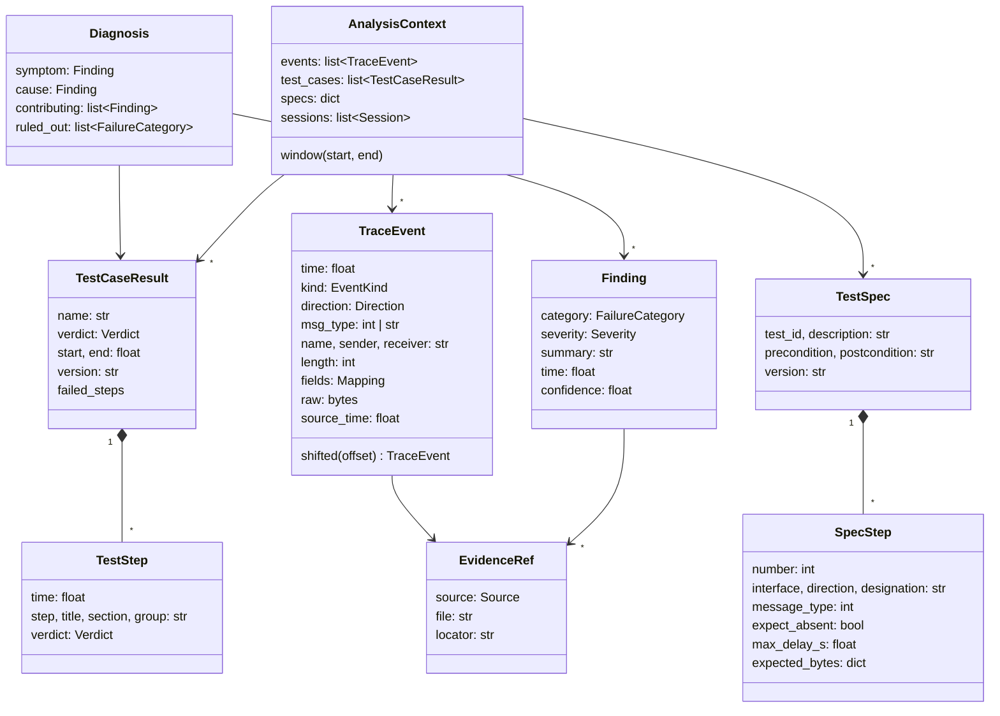

# Architecture

The analyzer reads one test run from several sources, puts every observation on one timeline, correlates it
with the test cases and lets a set of rules explain each failed test case. Facts about the input data are in
[data_understanding.md](data_understanding.md).

## 1. Pipeline

The input files have three roles: the Test_Description says what should happen, the PDF report what CANoe
did, the traces why. Readers keep each source's native time base; the time aligner puts everything on CANoe
measurement time before the network merge and correlation. Synthetic scenarios replace the pcapng with an
edited copy and check the diagnosis.

| Stage | Module | Input | Output | Phase |
|---|---|---|---|---|
| Readers | `readers/` | one file each | `SourceData` (events, test cases or specs, time base) | 3 |
| Network decoder | `readers/decode.py`, `readers/network.py` | raw Ethernet frames from PCAPNG or BLF | RaSTA, SCI-TDS and network events | 3 |
| Time aligner | `correlate/timebase.py` | all `SourceData` | events on CANoe measurement time | 4 |
| Correlator | `correlate/` | aligned events, test cases, specs | `AnalysisContext` (sorted events, sessions, test cases, specs) | 4–5 |
| Rule engine | `rules/` | `AnalysisContext` | `Finding`s, one `Diagnosis` per test case | 5 |
| Reporter | `report/` | diagnoses | Markdown/HTML report with timeline and evidence | 7 |
| CLI | `cli.py` | `config/config.yaml` | report files in `output/` | 7 |

## 2. Data model

All classes live in `trace_analyzer.model`.

Key points:

- **One event type for every source.** `TraceEvent.kind` says what it is (`rasta`, `sci_telegram`, `variable`,
  `operator_action`, `log`, `test`, `network`); `fields` carries the decoded payload, for example
  `{"belegung": 3, "grundstellbar": 0, "achszaehlfuellstand": 0}` for a GFM-A status telegram.
- **Every event keeps its evidence.** `EvidenceRef` (file + frame/page/line/object) goes into every finding,
  so the report can say "pcapng frame 425" or "PDF page 57".
- **Symptom vs. cause.** A `Diagnosis` separates what the test reported (`symptom`, e.g. precondition timeout)
  from the deepest explanation (`cause`, e.g. GFM-A disturbed), plus contributing findings and the
  categories that were checked and ruled out.
- **Protocol vocabulary** (`model/protocol.py`): RaSTA message types and disconnect reasons, SCI-TDS BL5
  telegram codes with spec sections, field enums (Belegung, Grundstellbarkeit, …) and BL5 telegram lengths.

## 3. What each source contributes

| Source | Reader | Events | Other output | Native time |
|---|---|---|---|---|
| PCAPNG | PCAPNG + network decoder | `rasta` (connect, heartbeat, data, disconnect + reason, sequence numbers), `sci_telegram` (code, sender, receiver, fields, length), `network` (ARP, ICMP) | – | epoch |
| BLF Ethernet | BLF + network decoder | same as PCAPNG | used for alignment and completeness check | measurement |
| BLF objects | BLF object | `variable` (e.g. `GFMAs[0].meldungGFMABelegungszustand`, RaSTA/SCI state transitions), `operator_action` (`Panel_ZE.kdSelection`, connect/disconnect buttons), `test` (configuration/unit/case start and end with verdict) | test case windows | measurement |
| PDF report | PDF report | – | `TestCaseResult` with steps, verdicts, target states, failure texts, BTP validation tables | measurement |
| CANoe log | CANoe log | `log` (decoded GFM-A status, system messages such as "Execution stop forced") | – | measurement |
| Test_Description | test spec | – | `TestSpec` with expected telegrams, `NOT` steps, timing limits, expected bytes | relative (`t1`) |

The SCI-TDS telegram spec (xlsx) is reference material; its content is encoded in `model/protocol.py`.

## 4. Time alignment

Module `correlate/timebase.py`. Master timeline: **CANoe measurement time** (BLF, CANoe log and PDF already use
it, offset 0). PCAPNG (epoch time) gets `t = t_epoch + offset`, with the offset taken from the first method
that works:

| # | Method | Source of the offset | Accuracy (RealOC run) |
|---|---|---|---|
| 1 | `frame_match` | identical frames in PCAPNG and BLF; median of the per-frame offsets, plus spread and drift | 2,159/2,159 frames, spread 0.7 µs, drift ≈ 0 ppm |
| 2 | `rasta_timestamp` | the test system's RaSTA timestamps, which CANoe fills with measurement time in µs | within 1 ms (send delay) |
| 3 | `measurement_start` | start clock (BLF header or CANoe log) + date and UTC offset from the PDF | within 2 ms |
| 4 | `first_frame` | no measurement-time source: time counts from the first frame | relative only |

- Every result is an `Alignment` (method, samples, spread, drift). A spread above `alignment.max_spread_ms`
  becomes a `time_alignment` finding in the rule stage.
- **Consistency checks** after alignment compare observations that exist in two sources: GFM-A status
  (network vs. CANoe log, network vs. BLF variable) and test-case start times (PDF vs. BLF). RealOC run:
  all matched, largest difference 5 µs.
- **Absolute time.** The measurement start in UTC follows from the PCAPNG offset; comparing it with the BLF
  header's local start clock gives the test bench UTC offset (+02:00). `Timeline.absolute(t)` converts any
  master time to wall-clock time.

## 5. Correlation

1. **Deduplicate network data** (`correlate/timeline.py`). PCAPNG and BLF Ethernet contain the same frames.
   PCAPNG is primary when present (Wireshark frame numbers); matched BLF frames are dropped and referenced in
   `fields["duplicate_ref"]`; frames only the BLF has stay in the timeline and are listed in `MergeStats`.
2. **Sessions.** RaSTA connection request → disconnection request.
3. **Test case windows** from BLF test-structure events, cross-checked with the PDF begin/end times.
4. **Assign** every event and session to the test case whose window contains it.

## 6. Rules

Each rule implements `rules.base.Rule`: `categories` it can report, `evaluate(ctx)` returning `Finding`s, and
`applies_to(tc, ctx)`. A category counts as **ruled out** for a test case only if a rule that applies to it
ran and found nothing; network rules apply only while a RaSTA connection existed, the spec rule only once the
test reached its trigger step, the cascade rule from the second test case on.

| # | Scenario | Category | Rule (module) | Evidence used |
|---|---|---|---|---|
| 1 | Response timeout | `timeout` | `ProtocolResponseRule`, `SpecExpectationRule` (protocol) | start-up request/response pairs; spec step `max_delay_s` after the trigger command |
| 2 | Missing message | `missing_message` | same | response never arrives |
| 3 | Unexpected response | `unexpected_response` | `SpecExpectationRule` | spec `NOT` steps vs. RX telegrams within the step window |
| 4 | Wrong message order | `wrong_order` | `OrderRule` | start-up order: version check → Aufrüstanforderung → Aufrüstbeginn → reports → Aufrüstende; commands before Aufrüstende |
| 5 | Invalid payload | `invalid_payload` | `PayloadRule`, `SpecExpectationRule` | field value ranges, protocol type, unknown type, sender/receiver vs. `nodes`, spec byte values, failed report checks, same frame with different bytes in the two captures |
| 6 | Incorrect length | `incorrect_length` | `LengthRule` | BL5 telegram length, RaSTA length errors, failed report length checks, Test_Description expects bytes beyond the telegram the device sends (spec BL6/BL7 48 bytes vs. RealOC 47), same frame with different length in the two captures (sender vs. receiver side) |
| 7 | Connection interruption | `connection_interruption` | `ConnectionRule` (connection) | unanswered connection request, RaSTA gap > `max_message_gap_ms`, disconnect reason ≠ user request, disconnect by the device |
| 8 | RaSTA sequence error | `sequence_error` | `SequenceRule` | sequence gaps/repeats per direction, retransmission messages |
| 9 | Precondition not reached | `precondition_not_reached` | `PreconditionRule` (state) | target state from the Test_Description precondition (else the report's "Sollzustand") vs. actual GFM-A state: failed preparation step, or main part started in another state |
| 10 | GFM-A disturbed | `device_disturbed` | `DeviceStateRule` | Belegung = 3 (transition, or inherited at the start of a test case), precursor (occupied with fill level 0 within 1 s), reset windows without AZG/AZGH |
| 11 | Cleanup failure cascade | `cascade_failure` | `CascadeRule` | previous cleanup failed and disturbed state at test start |
| 12 | Test aborted | `test_aborted` | `AbortRule` | BLF test-structure abort, report and CANoe log stop messages |
| 13 | Configuration mismatch | `configuration_mismatch` | `ConfigurationRule` (config) | spec byte values invalid for BL5, Test_Description precondition vs. report "Sollzustand", test case version report vs. spec |
| 14 | Command rejected | `command_rejected` | `CommandRejectedRule` | Meldung Kommando abgewiesen + reason + the command it answers; error if the test relied on the command, warning for the trigger of a negative test (only `NOT` steps) |
| 15 | Time alignment | `time_alignment` | `TimeAlignmentRule` | coarse alignment method, offset spread, inconsistent sources, frames only in one capture |
| – | Manual intervention | `manual_intervention` | `ManualInterventionRule` | panel actions, flagged when the test instruction forbids them; effect on the GFM-A state |
| – | Unexplained step failure | `test_step_failed` | `TestStepRule` | failed main-part step (symptom when no protocol rule explains it) |

Every finding has a severity (`error`, `warning`, `info`), a confidence (0–1) and evidence references.

**Diagnosis per test case** (`rules/engine.py`), for every test case that failed, was inconclusive, or passed
in the report although an `error` finding belongs to it:

1. Symptom: the earliest of `test_aborted`, `precondition_not_reached`, `test_step_failed`, else the earliest
   error. A `test_step_failed` is replaced by a protocol finding for the same spec step if there is one.
2. Cause: the earliest `error` finding of the test case up to the symptom, ties broken by precedence
   (cascade → connection → sequence → device state → configuration → rejection → length → payload → order →
   missing → timeout → unexpected). The cascade finding is dated at the test start, so an inherited state
   wins over its later symptoms. If the test failed in its preparation, findings about spec steps (which never
   ran) are not candidates: the 48-byte spec layout of 02288 is a failure of its own, not the reason for the
   precondition timeout. If nothing qualifies, a self-explaining symptom (abort, missing telegram, …) is its
   own cause.
3. Contributing: all other findings of the test case. Ruled out: see above; observations
   (`manual_intervention`, `time_alignment`) and symptom categories are never listed.
4. Verdict (`Diagnosis.verdict`): the report's verdict, except that a test the report passes is `fail` if an
   `error` finding belongs to it.

`pipeline.analyze(cfg)` runs readers → timeline → context → rules → diagnoses in one call.

## 7. Configuration

`config/config.yaml`: data paths (`base_dir` relative to the config file), `sources.blf_ethernet` (use the BLF's
Ethernet frames, or only its CANoe objects), SCI-TDS baseline and RaSTA port (`protocol`), the two `nodes` (IP and
ID of test system and device under test), timing limits from the test spec and report, RaSTA limits, alignment
tolerance, output directory.

## 7b. Report and command line

`python analyze.py --config … [--out DIR] [--format md html] [--test-case ID]` (`cli.py`) runs the pipeline,
prints a verdict table and writes the reports (`report/`):

- `build.py` turns the result into one section per test case: analyzer and report verdict, detected failure
  (symptom), root cause with category (field element / test bench, test sequence, communication, SCI-TDS
  protocol, configuration, data quality), consequence (cascade into the next test case), confidence and the
  sources behind the cause, evidence lines (file, frame/page/line, measurement and wall-clock time), further
  findings, ruled-out categories and the events of the test window (telegrams, connection, steps, panel
  actions, CANoe log messages).
- `timeline.py` draws the timeline of each test case as a self-contained SVG: lanes for findings, test steps,
  manual panel actions, telegrams per direction, the RaSTA connection and the GFM-A state (step line, reset
  windows as a wash), with cause and symptom as labeled vertical rules and a tooltip on every mark. The colors
  are a validated two-slot categorical palette plus fixed status colors, with light and dark variants.
- `templates/report.md.j2` (with the SVG files next to it) and `templates/report.html.j2` (SVG inline, no
  external resources, light/dark).

Example: [example_report/TC_NPRO.295.02288.01.md](example_report/TC_NPRO.295.02288.01.md).

## 7a. Synthetic scenarios

`trace_analyzer.synthetic` builds failure scenarios the RealOC run does not contain: `Capture` edits a copy of the
pcapng at RaSTA level (data ↔ heartbeat with the same sequence number, add/remove/edit application data, drop
frames, shift timestamps; lengths and IP/UDP checksums recomputed, safety code kept), `scenarios.py` lists the 15
scenarios with the conclusion the analyzer must reach, `python -m trace_analyzer.synthetic` writes the captures to
`data/synthetic/` and checks every scenario. Details and results: [scenarios.md](scenarios.md).

## 8. Design decisions

| Decision | Reason | Trade-off |
|---|---|---|
| Decode RaSTA and SCI-TDS in Python (`readers/decode.py`), layouts taken from the NeuPro Lua dissectors | Malformed telegrams are kept with an error instead of being dropped (the Lua dissector stops with a range error), which the length/payload rules need; BLF frames are decoded directly in measurement time; no Wireshark needed at runtime | Each new baseline needs its layout added. The test suite compares every decoded telegram with the Lua dissector output (tshark) to keep both in line |
| Own parser for BLF objects | Wireshark ignores CANoe variables, panel actions and test structure, which carry the test context | Object layout partly reverse-engineered; verified against the network frames |
| PDF text extraction with PyMuPDF | Report is text-based; the step log has a stable column layout | Layout changes in other CANoe versions need parser updates |
| CANoe measurement time as master timeline | Three of five sources already use it | PCAPNG needs the BLF or log start time |
| Plain dataclasses, no ORM or database | Small runs (thousands of events), simple to test | Very large runs would need streaming |

## 9. Extension points

- New source format: implement `readers.base.Reader` and return `SourceData`.
- New failure type: implement `rules.base.Rule`, add a `FailureCategory` if needed.
- New SCI-TDS baseline: set `wireshark.sci_tds_baseline` and add its lengths/enums to `model/protocol.py`.
